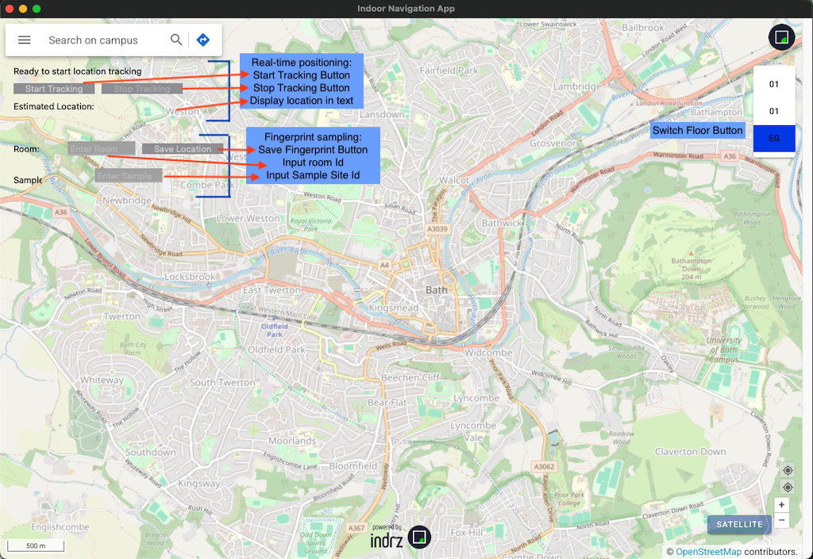

# IndoorNavClient
MacOS client for dissertation 'Development of an Indoor Campus Navigation Solution based on Floorplan Transformation and Wi-Fi based Positioning'

Use CoreWLAN module in Swift to do network scanning

